## Introduction

One-stop-shop for **Artificial Intelligence and Machine Learning for Official Statistics Project** (AIML4OS) is an ESSnet collaborative project involving 16 countries, started on 1 April 2024 and will last 4 years.

The overall aim is to develop a ‘*One Stop Shop*’ for AI and ML in official statistics; that is, a platform which provides a single entry point for ESS staff to access a coherent set of capabilities for implementing AI/ML based solutions. This will provide them with tailored guidance and assistance in deploying AI/ML solutions within adequate methodological and implementation frameworks.  The project is developed through 13 WPs, 6 supporting implementation and 7 dedicated to use cases. To learn more about AIML4OS see <https://cros.ec.europa.eu/dashboard/aiml4os>

WP 4 focuses on the state of play & ecosystem monitoring and gathers evidence of the current state of AI/ML use in the ESS. The WP4 team developed a short online questionnaire designed to get a high level overview of the key challenges and successes in this area. This report present its results in the 4 areas:

A.  **Organizational Aspects** Addresses ML architecture, integration, ownership, and responsibilities within the NSI.

B.  **Quality Standards** Assesses the existence of quality standards for ML processes.

C.  **Human Resources** Focuses on ML skill development strategies and staff competencies.

D.  **Current Issues and Challenges** Evaluates organizational and technical limitations affecting ML initiatives.

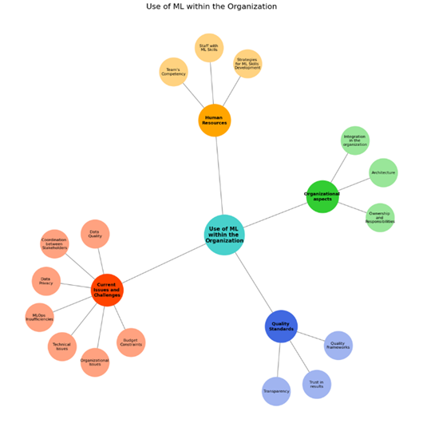

## Preliminary

This report presents the findings of a survey designed to assess the current state of machine learning (ML) adoption and governance within National Statistical Institutes (NSIs). The survey explores key areas such as ML architecture and integration, ownership and responsibility models, the existence of quality standards for ML processes, staff competencies and ML skill development strategies, and the organizational and technical limitations affecting the implementation of ML initiatives.

A total of 29 institutions from 28 countries participated in the survey. The countries represented include: Austria, Belgium, Canada, Croatia, Cyprus, Czech Republic, Denmark, Estonia, France, Germany, Hungary, Iceland, Ireland, Italy, Liechtenstein, Lithuania, Luxembourg, Malta, Netherlands, Norway, Poland, Portugal, Serbia, Slovenia, Spain, Sweden, Switzerland, Turkey, and a category labeled "Other" to account for additional responses.

To contextualize the results, the first section of the report focuses on responses to six preliminary questions, aimed at characterizing the participating institutions and their current stance regarding the adoption of ML. These initial insights provide the foundation for interpreting the detailed findings presented in the subsequent sections.

### Question P1

**Institutional Affiliation** The first institutional question was: “Which National Statistical Institute (NSI) within the European Statistical System (ESS) do you belong to?” From this, the respondent's country was identified, allowing for potential analysis of geographic or regional patterns in ML adoption and strategies. A total of 29 institutions from 28 different countries participated, including both EU and non-EU members. This geographical spread provides an opportunity to explore whether clusters of neighboring countries exhibit similar behaviors or face common challenges in their ML journeys.

The participating countries were: Austria, Belgium, Canada, Croatia, Cyprus, Czech Republic, Denmark, Estonia, France, Germany, Hungary, Iceland, Ireland, Italy, Liechtenstein, Lithuania, Luxembourg, Malta, Netherlands, Norway, Other, Poland, Portugal, Serbia, Slovenia, Spain, Sweden, Switzerland, and Turkey.

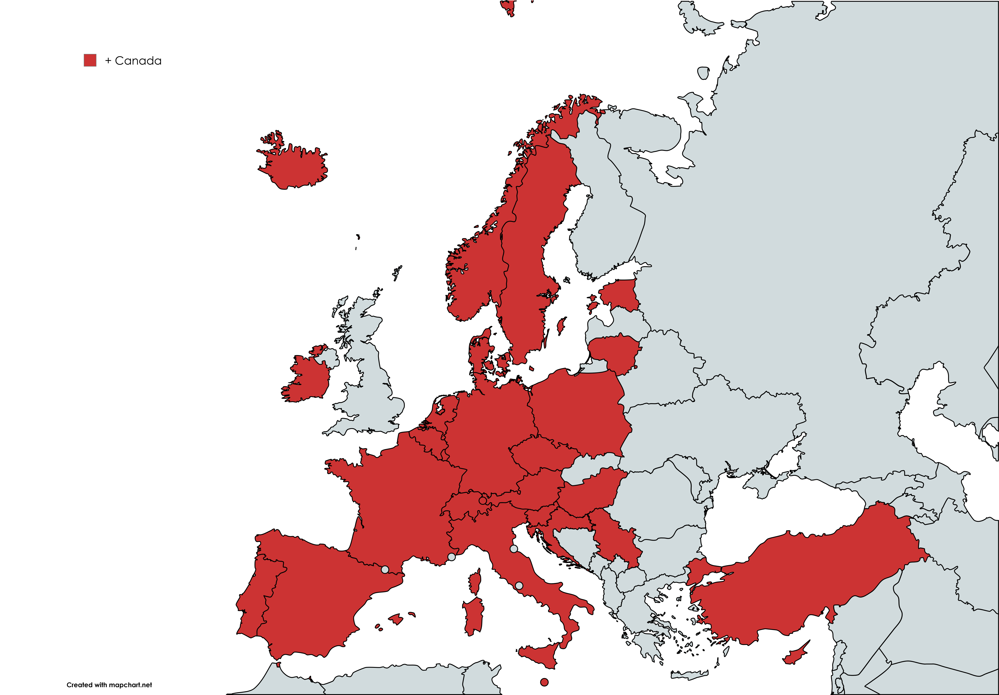

### Question P2

The second question, “Please provide the name of your organization,” was included solely to allow for potential follow-up in case particularly insightful or unique responses warranted further clarification or exchange. Respondents were under no obligation to provide this information, and its use remains entirely respectful of their privacy and discretion.

### Question P3

**Respondent Profile** The third question of the survey asked: “Which option best describes your role in your organization?” This question was designed to characterize the professional background of the respondents, as their roles may influence how they perceive ML architecture, the strategies applied within their institutions, and the limitations they encounter.

The results reveal that the majority of respondents are either Managers/Policy Makers or Statisticians/Data Scientists, representing 52% and 41% of the total responses, respectively. A small portion of responses (7%) came from Software Engineers or IT Specialists. Notably, no responses were recorded from Analysts/Subject Matter Specialists, which may reflect the focus of ML initiatives within the participating institutions or the distribution of expertise involved in such projects.

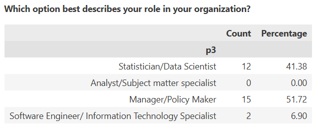

### Question P4

The fourth question, “Are you using Machine Learning in your institution?” was a key point in the survey, as it helped distinguish between institutions that are actively engaging with ML technologies and those that are not.

Out of 29 responses, 26 institutions (around 90%) indicated that they are currently using Machine Learning in some capacity. Only 3 institutions reported not using ML. This strong majority suggests that ML adoption is already widespread across the NSIs surveyed, setting the stage for a more detailed exploration of how it is being integrated, governed, and supported within each context.

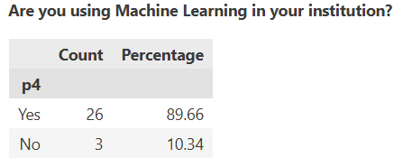

### Question P5

Among the institutions not currently using Machine Learning (ML), the reasons provided reflect a combination of practical limitations and cautious strategic planning. Rather than rejecting ML, these institutions are taking a measured approach based on their specific contexts. The answers were grouped in 5 categories as described below:

1.  **Resource Constraints** - The most frequently mentioned barrier is the lack of resources. Smaller offices, in particular, highlight difficulties in allocating the necessary capacity,whether in staffing, time, or infrastructure, to begin developing ML initiatives. For them, ML remains an aspiration rather than a current operational possibility.

2.  **Experimental/Exploratory Stage** - Some institutions report being in an exploratory or experimental phase. They are assessing the potential of ML in targeted use cases, such as automatic coding, but have not yet moved into broader or production-level deployment. These efforts remain confined to research and testing stages.

3.  **Lack of Immediate Need or Use Cases** - In other cases, the absence of pressing use cases or business needs plays a role. Where traditional statistical methods are still fully adequate and mandated by regulation, institutions see little immediate benefit in replacing or complementing them with ML approaches, particularly when added complexity is not justified.

4.  **Concerns about Interpretability and Transparency** - Concerns about the interpretability and transparency of ML models also emerge. Since official statistics demand traceable, auditable, and reproducible processes, the opaque nature of some ML techniques is seen as a limiting factor, especially in the context of accountability and public trust.

5.  **Capacity Building and Skill Gaps** - Lastly, skill gaps are mentioned as a significant limitation. Some institutions note that their current teams lack adequate training in ML methods. However, they are actively investing in internal capacity building, which may pave the way for future ML adoption.

Despite these constraints, all respondents express an openness to the integration of ML in the future, showing a shared awareness of its potential and a commitment to gradually preparing for its responsible use.

### Question P6

The question  How do you define ML in your organization? In particular would you agree with this following definition:

“*Machine Learning often (but not always!) involves:*

*- non-parametric statistical methods,*

*- recognizing patterns and relationships,*

*- a focus – at least in so-called supervised learning – on prediction (and less on explanation),*

*- methods which are used to answer specific questions without being explicitly given the solution,*

*- thus are generally data-driven rather than model-driven*

*- and are characterized by the fact that the solution space (meaning the hypothesis space) is often so large that it (approximately) contains all patterns and relationships”*\
was only asked to those institutions that currently use ML.

**Majority Acceptance with Nuance -** A majority of respondents, 15 out of 26 (approximately 58%), either completely agreed (7) or mostly agreed with minor reservations (8) with the provided definition. This suggests that the proposed description captures a broadly accepted understanding of ML within the community of national statistical institutions (NSIs).

**Low Explicit Disagreement -** No respondents selected “Disagree” or “Strongly disagree”, which reinforces the idea that the core elements of the definition (non-parametric methods, pattern recognition, data-driven focus, and large hypothesis spaces) are aligned with how ML is generally conceptualized in this context.

**High Rate of Neutrality -** Notably, 9 respondents (about 35%) marked “Neutral”, indicating that their institution does not have a formal definition of ML. This reflects a possible gap in institutional strategy or shared understanding, and may suggest that ML is being used in a more exploratory or ad hoc manner in these organizations. It also points to potential opportunities for internal clarification or standard-setting in future capacity-building work.

**Limited Partial Agreement -** Only 2 respondents (around 8%) found the definition too narrow, which implies that while some organizations have unique interpretations or broader frameworks, this is not widespread.

**Overall Conclusion:** Generally, the definition provided resonates with most institutions and appears to reflect the practical understanding of ML in statistical contexts. However, the relatively high number of neutral responses shows that a significant number of institutions may still lack internal alignment on what ML precisely is, possibly due to its novelty or evolving nature in official statistics. This could affect how ML is integrated across processes and highlights an opportunity for shared guidance or discussion within the ESS.

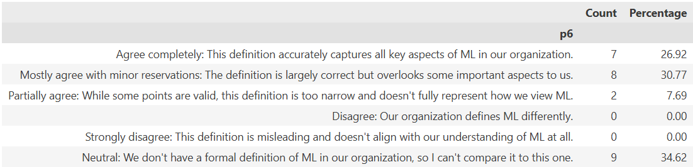

To better understand the overall sentiment toward the proposed definition of Machine Learning, we attributed ordinal values to each response (from 6 for “Agree completely” to 1 for “Strongly disagree”). The resulting average score was 4.5, and the median was 5, suggesting that respondents mostly agree with the definition, albeit with some reservations. This reinforces the idea that while a majority are aligned with the description, there remains space for interpretation and further clarification of ML concepts within NSIs.

## Organizational Aspects

Addresses ML architecture, integration, ownership, and responsibilities within the NSI.

### Question A1

How has Machine Learning evolved and been integrated into your organization over time? Several options could be selected.

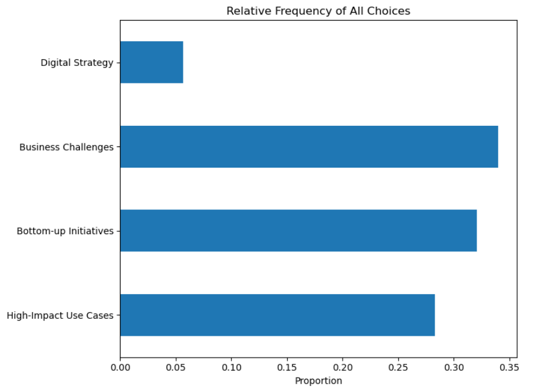

**ML adoption is often driven by practical needs.** “In response to specific business challenges" was the most frequently selected strategy across all roles, especially by Statisticians/Data Scientists (8) and Managers/Policy Makers (9).

Bottom-Up innovation plays also a Major role. "Gradually, through bottom-up initiatives" was highly selected by Managers/Policy Makers (10) and Statisticians/Data Scientists (7).

High-Impact Use Cases help build momentum. “By identifying and implementing high-impact use cases" was also a common strategy, especially among Statisticians/Data Scientists (7) and Managers (7).

Digital Strategy is less common "Through a dedicated digital strategy" was selected by very few respondents.

**Overall Conclusion:** ML integration in statistical organizations is largely problem-driven and organically developed through bottom-up efforts and successful use cases, rather than being guided by a centralized digital strategy, suggesting a gap in strategic planning.

### Question A2

What is your organization's architecture to support its ambitions towards Machine Learning? Several options could be selected.

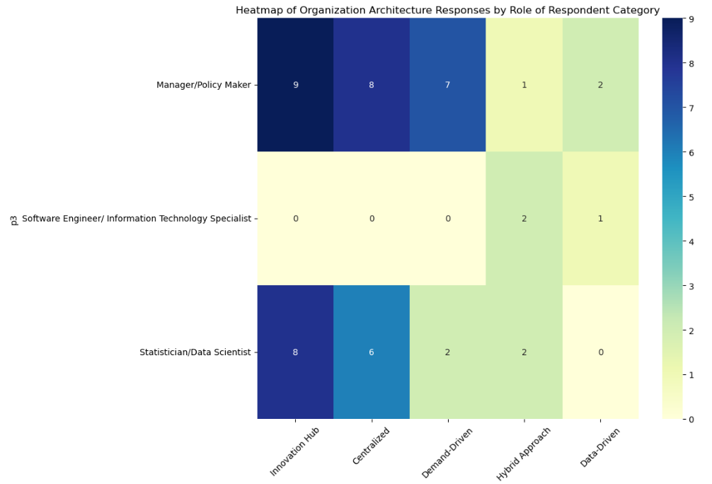

**Innovation Hubs lead**. The most commonly perceived architecture is Innovation Hub and Pilot Projects, suggesting that many organizations foster experimentation and early-stage ML initiatives.

Strategic and Collaborative Models are also prominent. Centralized, Strategic Approaches and Demand-Driven, Collaborative Approaches are also widely perceived, indicating a mix of top-down planning and bottom-up responsiveness. This reflects a dual perception: organizations are both structuring ML efforts strategically and responding to internal demand.

Hybrid Models are present but less dominant. The Hybrid Approach with Expert Input is moderately represented, suggesting that while some organizations blend strategies, this is not yet the dominant model. Surprisingly, Data-Driven Decision-Making is the least cited, which may indicate a gap between ML capabilities and their integration into organizational decision-making processes.

**Overall Conclusion:** These results suggest that while many organizations are experimenting with ML and building strategic frameworks, fewer are perceived as having fully integrated ML into decision-making. This could point to a maturity gap: ML is being explored and structured, but not yet deeply embedded in operational or strategic decisions.

## Quality Standards

Assesses the existence of quality standards for ML processes.

### Question B1

Does your organization have regulations, guidelines, instructions, frameworks or standards that are relevant and ML-specific for the use of ML? Examples could include: special compliance requirements (e.g. data protection, ethics, information security), a special quality framework, special methodological requirements, definition of special roles and responsibilities, etc.

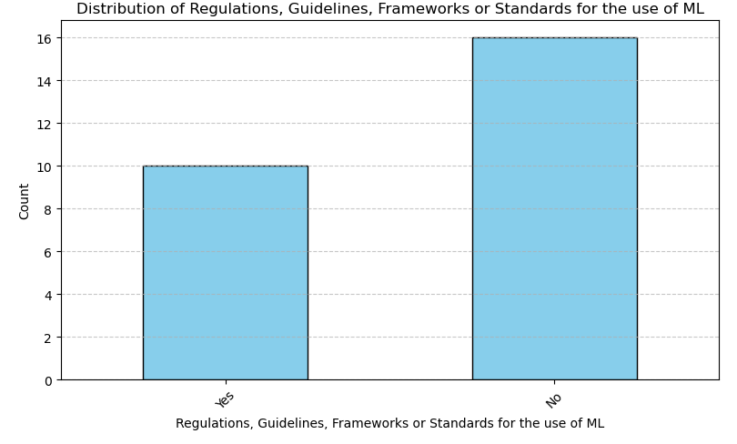

Out of 26 respondents, a minority (10) reported having ML-specific regulations, guidelines, or frameworks in place, suggesting that many organizations are actively addressing compliance, quality, and methodological aspects of ML. However, most organizations (16) still lack such measures, indicating a significant gap and potential risk area for governance and responsible ML adoption.

### Question B2

Which ones? *Only asked to those that answered Yes to the previous question, B1*

Respondents who reported having ML-specific regulations and guidelines described a range of measures, which can be organized into three broad themes. These themes reflect how organizations address compliance, methodological rigor, and governance in their use of ML.

**Data Protection & Compliance Requirements** Several institutions (4) explicitly mention GDPR and privacy principles. Rules to ensure only methodologically controlled, disseminated data can be used is mentioned by one institution (1), while restrictions on using non-compliant generative AI tools is mentioned by another(1). Emphasis on ethics, safety, and information security is also mentioned by one institution (1). Overall, compliance, data protection, and risk mitigation appear to be fundamental elements of their ML governance.

**Methodological & Quality Frameworks** Several institutions noted that they have quality frameworks or quality dimensions in place (4) or integrated ML process mapped to GSBPM (1). One organization (1) points to the existence of methodological guidelines for input/output data and model structure. Finally advisory support from methodology and quality teams is also mentioned (1). Largely these measeures reflect a systematic approach to maintaining standards and reproducibility.

**Roles, Responsibilities & Governance** A smaller but significant number of organizations mentioned governance structures for ML(3). Including: - Definition of special roles/responsibilities for ML projects (1). - AI Working Group reviewing planned use cases (1). Collaborative approach with data science division supporting business areas (1). These efforts indicate a move towards institutionalizing ML oversight and embedding it within organizational decision-making.

In conclusion, the most common focus is on data protection and GDPR compliance were the most frequently mentioned (over half of responses). Methodological and quality frameworks are well established, often linked to existing statistical production models (GSBPM). Governance structures (roles, working groups) are emerging in some organizations but not yet universal. This is probably the area where there’s room for further formalization.

### Question B3

Does your organization plan to introduce regulations, guidelines, instructions, frameworks or standards that are relevant and ML-specific for the use of ML in the foreseeable future? *Only asked to those that answered No to the B1 question*

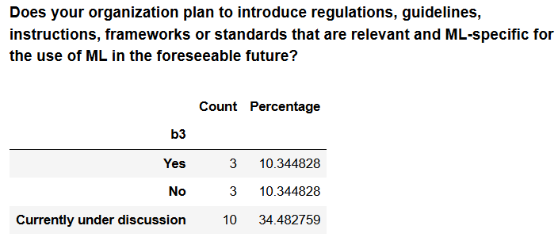

The answers to this question suggest that while most of the organizations currently lack ML-specific regulations and guidelines, there is clear momentum toward establishing them. The fact that 10 out of 16 are actively discussing the introduction of such measures shows growing awareness of the need for structured governance in ML. Only a small minority (3) explicitly stated they do not plan to introduce them, which indicates that the field is moving toward greater formalization and that the absence of regulations is likely to diminish over time.

### Question B4

Which ones? *Only asked to those that answered Yes to the previous question, B3*

Among the organizations that plan to adopt ML-specific regulations and guidelines, the focus is on establishing clear and practical structures. Examples include developing AI guidelines for the use of online large language models (1), defining a standard pipeline of tools, methods, and processes for automatic coding (‘text-to-code’) projects(1), and introducing comprehensive guidelines and standards to support consistent and responsible ML implementation (1).

These planned initiatives indicate a clear move toward formalizing ML practices and ensuring responsible, standardized use across projects.

### Question B5

How do you make the application of standards/frameworks visible (internally and/or externally)? Please select the most relevant option(s). *Only asked to those that answered Yes to the B1 question*

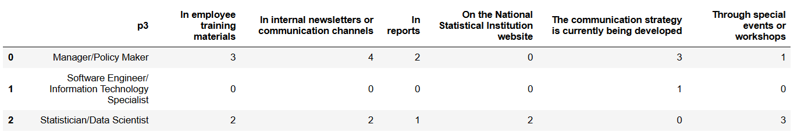 Software engineers are generally less involved in making the standards and frameworks visible within the organization. For managers and statisticians, internal newsletters or communication channels are the preferred means of dissemination, closely followed by the production of training materials. The organization of dedicated events or workshops is also considered highly relevant, particularly by statisticians. This group additionally relies on the National Statistical Institute websites for information, whereas managers tend to favor formal reports. The communication strategy is currently being developed even in countries who already do it by any of the means mentioned.

### Question B6

Was the introduction of standards/frameworks a bottom-up process (inspired by the needs from daily activities) or a top-down process (management's instruction to issue a guideline, for example)?

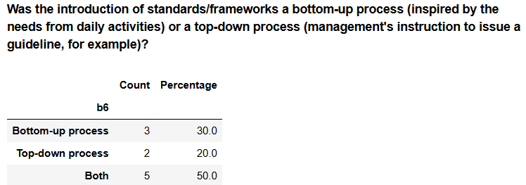

Half of the respondents indicated a combination of bottom-up and top-down approaches, showing that both operational needs and management directives influenced the process. Around 30% reported a primarily bottom-up approach, driven by practical needs in daily activities, while only 20% saw it as top-down, suggesting purely management-driven initiatives were less common.

## Human Resources

Focuses on ML skill development strategies and staff competencies.

Information was collected on several competencies such as Data Engineering, Data Visualization, and others, where respondents could choose from three categories: "Need to Expand/Improve," "Sufficient," or "Advanced." For any competency where the respondent selected at least "Sufficient," a follow-up question allowed them to select multiple capabilities within that competency to provide further detail on their skillset. We will present first the results to all the competencies and then analyze the breakdown by area.

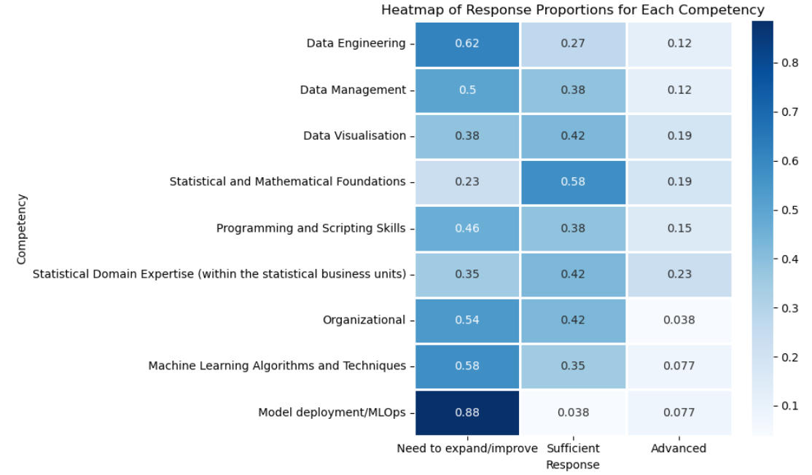

### Question C1

Within the domain: Please indicate the positions and skills where you believe your NSI has at least sufficient expertise and resources.

*C1_01* The majority (16 respondents) indicated a need to expand or improve capabilities on **Data Engineering**, while only 3 rated themselves as advanced. This suggests that the field remains a key skills gap and a priority area for capacity building.

*C1_02* Although 10 respondents rated their competence on **Data Management** as sufficient, 13 still saw a need to expand or improve. This reflects a moderate maturity level but with clear room for improvement, likely in standardization and governance practices.

*C1_03* Competence on **Data Visualization** is relatively balanced, with 11 considering their skills sufficient and 10 highlighting room for improvement. This area shows a fairly even distribution, but efforts could focus on ensuring consistency and advanced visual storytelling capabilities.

*C1_04* **Statistical and Mathematical Foundations** is, unsurprisingly one of the strongest areas: 15 respondents reported sufficient competence and 5 advanced, leaving only 6 citing a need to improve. This indicates a solid foundational knowledge base within the group.

*C1_05* Although 10 respondents felt their skills on **Programming and Scripting Skills** are sufficient, 12 saw the need for improvement. Training in modern programming practices, automation, and reproducible workflows could strengthen this area.

*C1_06* The **Statistical Domain Expertise** competency shows good balance: 11 considered their expertise sufficient and 6 advanced. With only 9 seeking improvement, this is one of the more mature areas, suggesting strong subject-matter expertise in statistical domains.

*C1_07* The **Organizational** area stands out as a challenge, with 14 respondents signalling a need to expand/improve and only 1 rating as advanced. This points to potential gaps in project management, communication, or coordination skills.

*C1_08* **Machine Learning Algorithms and Techniques** is still an emerging area for most respondents: 15 reported a need to expand/improve, only 2 rated as advanced. This suggests a strong opportunity for capacity building, particularly as ML becomes more integrated into statistical workflows.

*C1_09* **Model Deployment / MLOps** is the weakest competency overall, with 23 respondents (the overwhelming majority) reporting a need to expand or improve and only 1 indicating sufficient competence. This highlights a critical skills gap in operationalizing models and integrating them into production systems.

#### C1 Overall Results

The analysis reveals a workforce with solid grounding in statistical and mathematical foundations and domain expertise but significant gaps in more technical, engineering-oriented, and operational skills. Data engineering, machine learning, and especially model deployment/MLOps stand out as priority areas for development. Strengthening organizational skills would also support more effective collaboration and project execution. The results suggest that targeted training, practical projects, and knowledge sharing could significantly raise maturity in these competencies and better prepare the organization for modern data-driven challenges.

### Question C2

Within the domain "Data Engineering": Please indicate the positions and skills where you believe your NSI has at least sufficient expertise and resources.

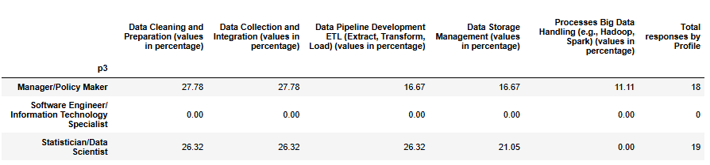

Managers/Policy Makers report that their institutions are stronger in core data engineering tasks such as data cleaning and integration, with noticeably lower emphasis on pipeline development and storage management, and minimal adoption of big data technologies (11%). Statisticians and Data Scientists, on the other hand, describe a more balanced distribution across the main competencies, with relatively even attention to cleaning, integration, pipeline development, and storage management, while big data handling remains largely absent (0%). This could suggest that managers tend to perceive institutional capabilities in terms of priorities or strategic focus, highlighting pronounced differences between areas, whereas statisticians provide a view from operational practice, showing more evenly developed processes in daily statistical production.

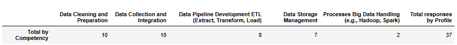

The survey results indicate that all institutions have strong familiarity with core data engineering activities. These competencies reflect the continuity of established workflows from regular statistical production. However, big data handling remains a clear gap, with minimal engagement. Addressing it gaps will likely require targeted training, capacity building, and closer coordination between statistical and IT teams.

### Question C3

Within the domain "Data Management": Please indicate the positions and skills where you believe your NSI has at least sufficient expertise and resources.

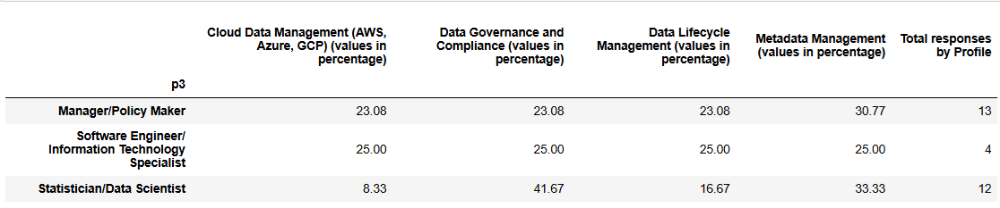

Managers/Policy Makers recognize their institutions as having relatively balanced competencies across the four areas, with metadata management rated highest (31%) and the others at about 23% each. Software Engineers/IT Specialists, a small group with only 4 responses, also report a perfectly balanced view, assigning 25% to each competency, which may indicate they see all four as equally developed or have a more generalized perception of institutional capabilities. Statisticians and Data Scientists, however, report a much more differentiated picture. They attribute 42% of their institution’s competency to data governance, far higher than the managers’ 23% (+19 percentage points), and also recognize strong competency in metadata management (33%). But they see cloud data management as very limited (only 8%), which is 15–17 points lower than managers (23%) or IT specialists (25%).

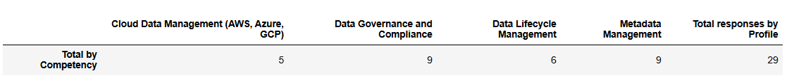

Recognition of institutional capability is lower here (29 total responses vs. 37 in the previous set), suggesting these competencies are less established. Metadata management (17 recognitions) and data governance (16) stand out as the strongest areas. Cloud data management is weakest (8), especially among statisticians (only 1). Statisticians emphasize governance (42% of their responses), while managers and IT specialists report more balanced competencies across areas.

### Question C4

Within the domain "Data Visualisation": Please indicate the positions and skills where you believe your NSI has at least sufficient expertise and resources.

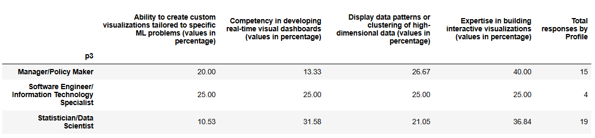 Overall, recognition of capability is highest for interactive visualizations (40% of managers’ and 37% of statisticians’ responses) and real-time dashboards (32% among statisticians), suggesting that transferable know-how from previous experience (e.g., dashboarding for official statistics) is strong.

In contrast, custom visualizations tailored to specific ML problems are least recognized (11% among statisticians), indicating a gap in highly specialized, problem-specific visualization skills. Managers again report a more balanced distribution, while statisticians emphasize tools that can generalize across tasks rather than bespoke solutions.

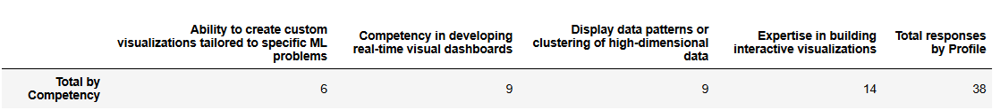 This set of competencies gathered 38 recognitions in total, a clear increase compared to the previous set (16), which may indicate that these skills are less complex and more widely accessible across institutions.

Overall, the strongest capabilities acknowledgement goes to interactive visualizations (14 responses) and real-time dashboards (11 responses), showing that institutions are relatively confident in their ability to build tools that present information in a usable, dynamic way. Recognition of custom, problem-specific visualizations remains low (5 responses), suggesting this is still a specialized area where expertise is limited.

### Question C5

Within the domain "Statistical and Mathematical Foundation": Please indicate the positions and skills where you believe your NSI has at least sufficient expertise and resources.

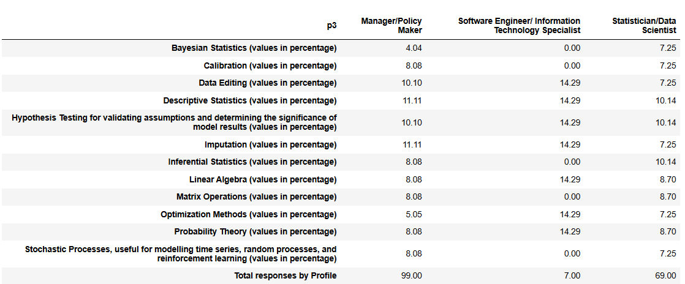 This set of competencies collected a large number of recognitions (175 in total), indicating that respondents are generally familiar with these statistical concepts. The overall distribution shows that descriptive statistics, hypothesis testing, and imputation are the most frequently recognized competencies (each around 10–14% per profile), reflecting their central role in official statistics.

However, some results raise concerns about whether respondents are reporting institutional capability or rather their own personal knowledge. In particular Software Engineers/IT Specialists reported no recognition for core statistical areas like: Bayesian statistics, inferential statistics, matrix operations, or stochastic processes. These are all essential to a statistical institute’s mandate thus their lack is a awkward.

These patterns suggest that answers might reflect individual comfort or experience rather than a comprehensive assessment of institutional capability. If that is the case, the results might understate the true capacity of the institutions, particularly in core statistical skills that are widely used but may not be recognized by non-specialists.

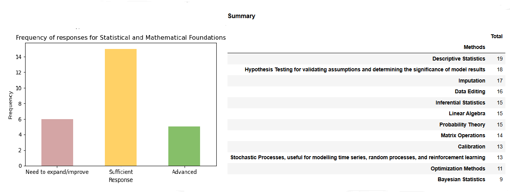

This set of statistical competencies shows a much higher volume of recognitions (175 across 12 competencies) compared with previous sets (around 38 across 4). This suggests that respondents view these skills as well established within their institutions and consider them part of their core expertise.

This was to be expected as only about 20% of institutions reported a need for further development in this field, creating the perception that most of these capabilities are already in place. The highest capabilities assessments are concentrated in descriptive statistics, hypothesis testing, and imputation, which are fundamental to regular statistical production.

### Question C6

Within the domain "Organizational": Please indicate the positions and skills where you believe your NSI has at least sufficient expertise and resources.

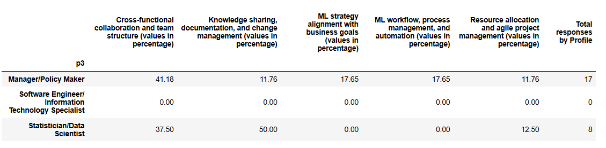

This set of competencies shows marked differences between profiles. Managers report strong institutional capability in cross-functional collaboration and team structure (41%), with moderate recognition in ML strategy alignment and workflow management (18% each), while giving lower scores to knowledge sharing, change management, and resource allocation. Statisticians, by contrast, emphasize knowledge sharing and documentation (50%) and cross-functional collaboration (38%), but report no recognition for ML strategy alignment or workflow management.

As in previous sets, low scores should not automatically be interpreted as institutional weaknesses; they may reflect areas where respondents do not feel personally skilled or responsible rather than a true lack of capability. These differences likely reflect the proximity of each profile to the respective activities: managers observe strategic and team-level structures, while statisticians experience operational processes like knowledge sharing.

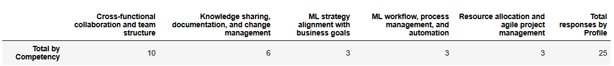

In this set of competencies, total recognitions are 25, lower than within the domains "Data Engineering" and "Data Visualization", suggesting these areas are less widely acknowledged. To account for the bias observed in earlier questions, where respondents may report their own knowledge rather than institutional capability, we use managers’ responses as a baseline for institutional strengths. Compared to this baseline, technical roles (statisticians and IT specialists) report fewer recognitions in strategic and workflow-related areas (ML strategy alignment, workflow management, resource allocation), highlighting a perception gap between managerial oversight and operational engagement, rather than necessarily reflecting true organizational weaknesses.

### Question C7

Within the domain "Programming and scripting skills": Please indicate the positions and skills where you believe your NSI has at least sufficient expertise and resources.

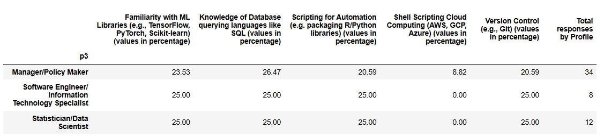

In this set of technical competencies, responses appear relatively balanced across profiles, with most areas receiving similar recognition. Managers report fairly even familiarity with ML libraries (24%), SQL (26%), scripting (21%), and version control (21%), with slightly lower recognition for cloud computing (9%).

Software Engineers and Statisticians show a similar pattern, generally recognizing ML libraries, SQL, scripting, and version control at 25% each, while cloud computing is not recognized at all (0%), highlighting that exposure to cloud platforms is still limited among these profiles.

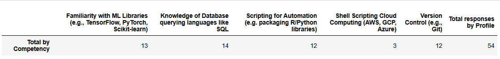

Overall, these results suggest that core technical skills, libraries, databases, scripting, and version control, are reasonably well established across institutions, while cloud-related capabilities (see cloud data management above) continue to be a recognized gap.

### Question C8

Within the domain "Statistical Domain Expertise (within the statistical business units)": Please indicate the positions and skills where you believe your NSI has at least sufficient expertise and resources.

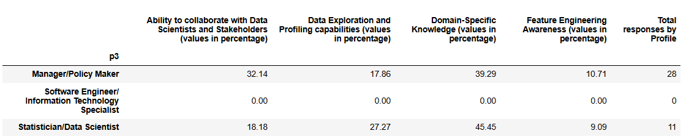

Managers report that their institutions are strongest in domain-specific knowledge (39%) and collaboration with data scientists and stakeholders (32%), with lower recognition in data exploration (18%) and feature engineering awareness (11%). Statisticians similarly emphasize domain knowledge (45%) and data exploration (27%), with relatively lower recognition for collaboration (18%) and feature engineering (9%).

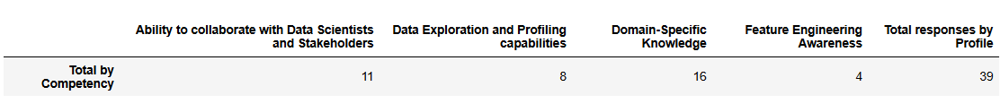

These results suggest that among institutions confident in their capabilities, domain knowledge and collaboration are relatively well established, while feature engineering and exploratory data profiling remain weaker areas, even among those with sufficient expertise. The limited responses underline that a substantial portion of institutions (48% see question C1 above) still perceive a need to further develop these competencies.

### Question C9

Within the domain "Machine Learning Algorithms and Techniques": Please indicate the positions and skills where you believe your NSI has at least sufficient expertise and resources.

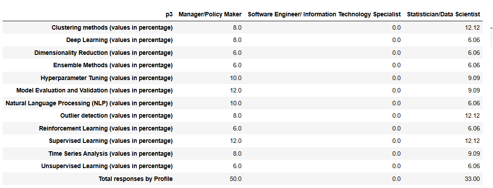

This set of competencies shows low reporting overall (83 responses across 12 topics), with 51% of the institutions recognizing the need to improve in this area. The input comes from managers (60%) and statisticians (40%). The strongest signals are for supervised learning and model evaluation/validation (≈12% each), suggesting these areas are where respondents feel their institutions are most capable.

Responses for more specialized techniques, such as reinforcement learning, dimensionality reduction, and ensemble methods (≈6%), are less frequent, which may reflect lower use in current practice rather than true institutional gaps. Given the possibility that respondents are reporting personal expertise rather than organizational capacity, these results should be read as an indication of where knowledge is most present among staff, not necessarily where the organization has formalized competence.

### Question C10

Within the domain "Model Deployment and MLOps ": Please indicate the positions and skills where you believe your NSI has at least sufficient expertise and resources.

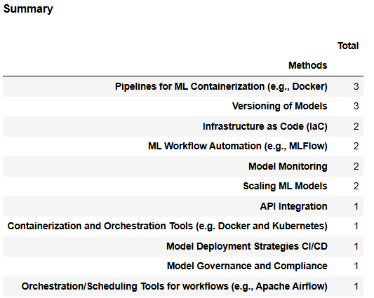

This set of results shows very limited institutional capability in ML operations, with only 16 total responses across 10 topics. Considering that 79% of institutions reported needing to improve in this area, this low number likely reflects that MLOps practices are still at an early stage of adoption.

Only 1 out of 26 respondents (≈3.8%) indicated capability in four key areas, API integration, container orchestration, CI/CD deployment strategies, and model governance. Only 2 respondents each (≈7.7%) reported competence in ML workflow automation, infrastructure as code, and model monitoring. These figures suggest that advanced operational practices for ML are rare and scattered, with no single area emerging as a clear strength.

Overall, these results confirm that MLOps is a critical development gap for most institutions and should be prioritized if machine learning is to be reliably scaled and governed in production environments.

### Question C11

Approximately how many employees work in your statistical agency?

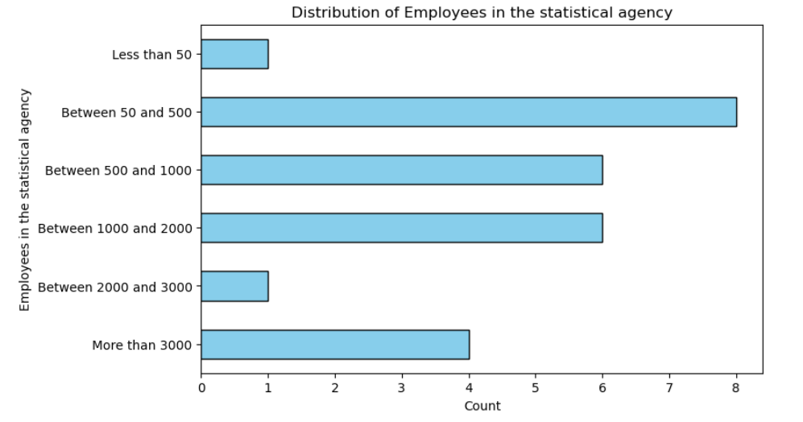

The survey results reveal a diverse landscape when it comes to the size of responding statistical agencies. Most of the participating institutions are medium-sized, with between 50 and 2000 employees, making up more than two-thirds of all responses. Very small agencies — those with fewer than 50 employees — and those in the 2000 to 3000 range are rare cases, each representing just a small fraction of the sample. At the other end of the spectrum, large institutions with more than 3000 employees account for around 14% of the responses and likely bring a more structured, well-resourced view of organizational capabilities.

This mix of agency sizes is important context for interpreting the other results in the survey, since institutional size can shape how respondents perceive available skills and where development is most needed. Larger agencies may have more specialized teams and formalized processes, while smaller agencies often rely on fewer people covering multiple roles.

### Question C12

Approximately how many Data Scientists work in your statistical agency?

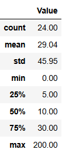

The responses for this question show a wide variation across institutions. With 24 valid responses (two institutions did not answer), the average value is 29, but the standard deviation is quite high (46), indicating substantial dispersion.

The median value is 10, meaning that half of the institutions reported values below this threshold, while the upper quartile reaches 30, and the maximum is 200, highlighting a few institutions with exceptionally high values compared to the rest. The minimum is 0, as 2 institutions report no activity in this area and 9 reported 6 or less.

Overall, these results suggest that while most institutions are concentrated in the lower range, with the median being 10. There are 3 outliers with significantly higher values (100 or more), which contributes to the large mean and standard deviation.

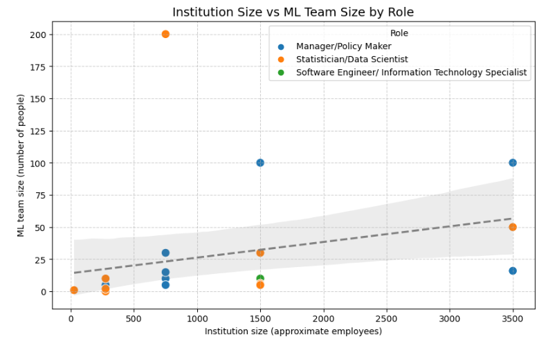

We observe a loose upward trend - larger institutions tend to have bigger ML teams. Despite this there's lots of scatter - smaller institutions that have very large ML teams, while big ones have smaller ones.

While larger NSIs are indeed represented mostly by managers, and team size grows roughly with institutional size, the strength of ML engagement appears also tied to strategic priorities rather than headcount alone. The data hints at organizational will - not just scale - being decisive in developing ML capabilities.

### Question C13

Do you plan to expand ML-related team(s)?

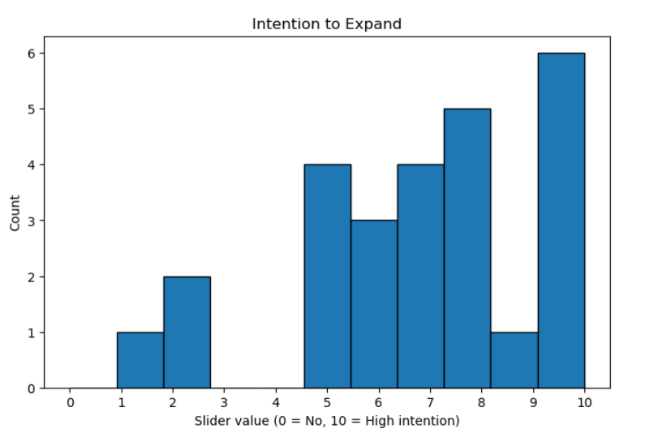

The responses indicate a moderate to high intention to expand ML-related teams. With 26 respondents, the average score is 6.92, and the median is 7, showing that half of the institutions report a relatively strong intention.

Overall, these results suggest that most institutions are inclined to grow their ML capabilities with 41,38% expressing a high intention (8-10). Despite this there is some variability, reflecting differing levels of readiness or strategic priority.

### Question C14

Do you mostly consume/use/configure ML-Algorithms coded in available Libraries, or do you implement/program yourself ML-Algorithms from scratch?

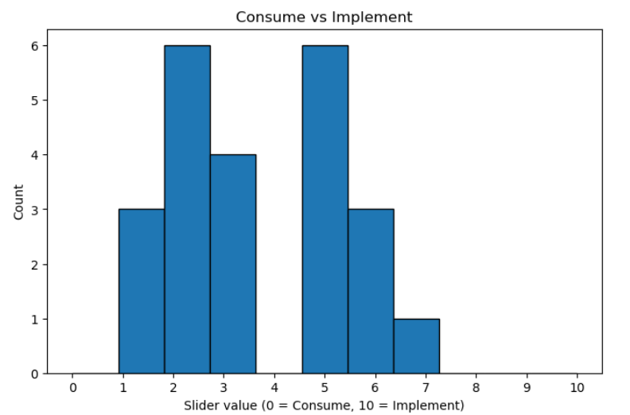 The responses indicate that, overall, institutions are more on the “consume” side of the spectrum rather than actively implementing. With 23 respondents, the mean score is 3.57 and the median is 3, reflecting a tendency toward consumption rather than production. The interquartile range (2–5) shows that most responses cluster in the lower half of the scale, while the maximum of 7 indicates that a few institutions are approaching higher implementation levels.

Notably, 44.8% of respondents mostly consume (scores 1–3), confirming that nearly half of the institutions are primarily users rather than implementers. The standard deviation of 1.88 highlights some variation, but the overall trend is clear: the majority of institutions still focus on consuming existing solutions rather than developing or implementing them themselves.

### Question C15

Which strategies has your organization found most effective in developing ML skills and expertise among staff? Please choose only the ones that have been particularly impactful for your organization.

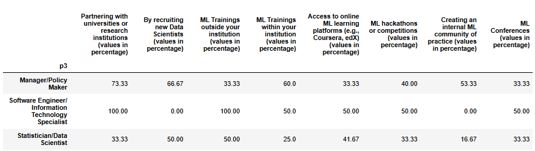

Across all profiles, the clearest signal is that partnering with universities or research institutions is seen as the most promising path to strengthen ML capacity. This option gathers the broadest recognition, with managers strongly aligned (almost three quarters selecting it), statisticians giving it moderate importance, and the small group of engineers fully endorsing it. Recruiting new Data Scientists comes a close second, with similar weight overall, though here managers and statisticians are the ones carrying the recognition, as engineers did not point to this option.

Training emerges as a third cluster of strategies, but perceptions diverge by role. Managers lean toward building internal capacity through institutional training, while statisticians and engineers value external opportunities, including formal courses outside the organization and access to online platforms.

Other formats such as hackathons, conferences, and especially communities of practice receive more uneven attention. Managers are relatively more inclined to recognize these, whereas statisticians and engineers mention them less often. This suggests that while collaboration and recruitment are widely acknowledged as essential, more innovative or informal mechanisms for capacity building are still not seen as central across all profiles.

## Current Issues and Challenges

Evaluates organizational and technical limitations affecting ML initiatives.

### Question D1

To what extent do the following organizational issues limit your organization's ability to use Machine Learning?:

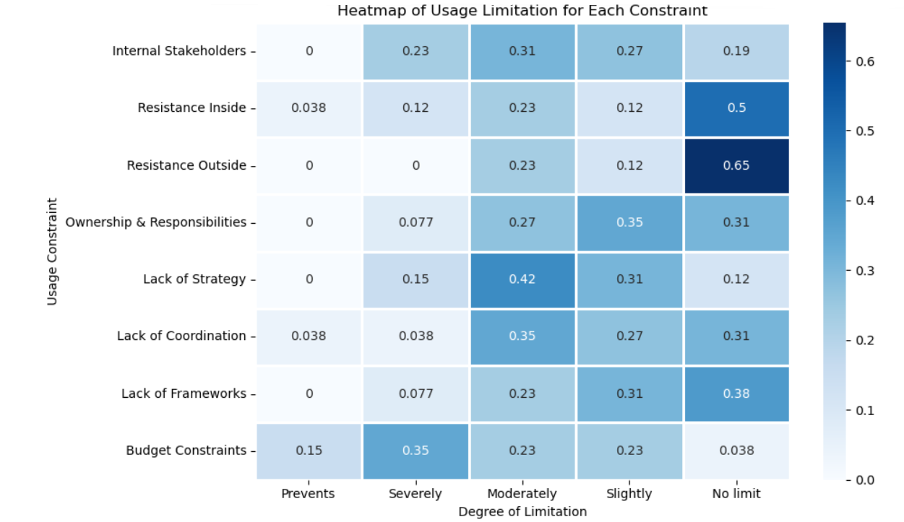

The analysis of responses to question D1 provides a structured view of perceived constraints across eight dimensions.

*D1_01* **Internal stakeholders** emerge as a moderate limitation. Among respondents, 8 reported moderate limitation, while 6 indicated severe limitation and 7 slight limitation. Only 5 respondents stated that this factor does not limit use. These figures suggest that the involvement and alignment of internal actors are neither fully obstructive nor enabling: they represent a persistent but manageable source of constraint.

*D1_02* Regarding **resistance inside the organization**, the majority (13 respondents) declared that it does not limit use. However, 6 reported moderate limitation, 3 severe limitation, and 1 respondent indicated that it prevents use entirely. The pattern points to overall institutional acceptance of ML initiatives, though isolated cases of internal opposition remain.

*D1_03* **Resistance outside the organization** is the least critical factor. 17 respondents stated that it does not limit use, while only 6 reported moderate limitation and 3 slight limitation. External environments therefore appear broadly supportive or neutral toward ML adoption.

*D1_04* The question of **ownership and responsibilities** yields a more balanced distribution: 8 respondents see no limitation, 7 report moderate limitation, 9 slight limitation, and 2 severe limitation. This suggests that ambiguity in accountability structures is a recurring, though not overwhelming, barrier to consistent ML implementation.

*D1_05* **Lack of strategy** stands out as one of the more significant obstacles. Only 3 respondents claimed it does not limit use, whereas 11 reported moderate limitation, 4 severe limitation, and 8 slight limitation. The prevalence of "moderate" and "severe" categories underscores that strategic direction remains insufficiently defined in many organizations.

*D1_06* Similarly, **lack of coordination** is reported by 9 respondents as a moderate limitation and by 7 as slight. Although 8 indicated no limitation, 1 respondent stated that it prevents use, and 1 identified a severe limitation. These figures reveal that coordination is generally adequate but vulnerable to fragmentation or silo effects.

*D1_07* The **lack of frameworks** dimension shows a distribution close to coordination: 10 respondents indicated no limitation, 6 moderate limitation, 8 slight limitation, and 2 severe limitation. This reflects an environment where procedural or methodological guidance exists in part but is not yet systematized across all contexts.

*D1_08* Finally, **budget constraints** appear as the most decisive barrier. Although no limitation was reported (1 respondent), 9 stated that financial constraints severely limit ML use, 6 indicated moderate limitation, 6 slight limitation, and 4 that it prevents use entirely. Budgetary and resource limitations thus remain the single most frequently cited structural obstacle.

#### D1 Overall Results

In summary, the results indicate that financial and strategic factors are the most substantial impediments to the institutionalization of Machine Learning. Cultural or attitudinal resistance, whether internal or external, is comparatively rare. Most respondents position their challenges at the organizational maturity level, where ML ambitions are acknowledged but hindered by insufficient strategic planning, coordination, frameworks for ML, and funding.

This distribution suggests a landscape in transition: organizations are largely receptive to ML in principle, but lack the institutional infrastructure to sustain its practical implementation.

### Question D2

To what extent does your organization invest resources to tackle the following organizational issues?:

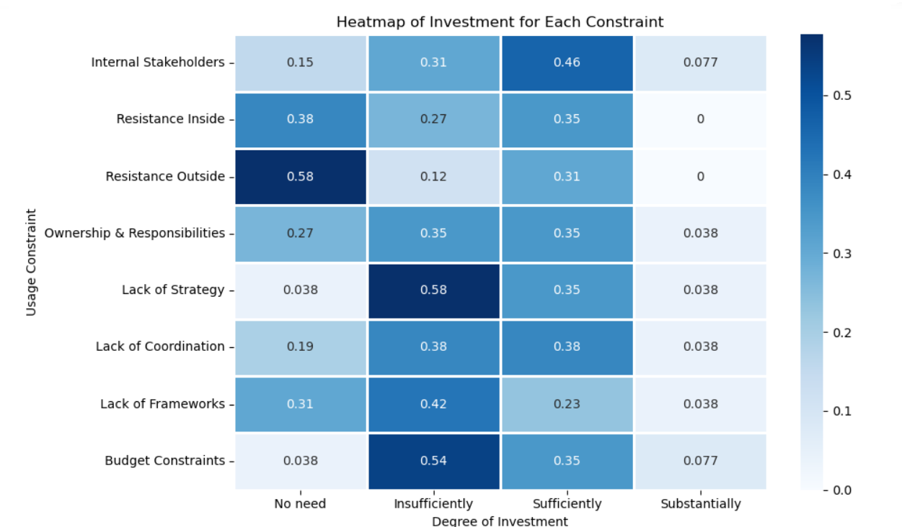

*D2_01* While **internal stakeholders** were identified as a moderate limitation in D1, the corresponding investment patterns suggest only partial alignment between perception and action. Eight respondents reported insufficient investment, while twelve considered their investment sufficient, and only two indicated substantial efforts. Four reported no need to invest. This balance indicates that institutions acknowledge the role of internal actors in shaping ML success but may underestimate the depth of organizational change required to strengthen engagement and alignment.

*D2_02* For **internal resistance**, D1 revealed relatively low concern, with a majority of respondents stating it does not limit use. The investment profile reflects this perception: ten respondents declared no need to invest, nine reported sufficient investment, and seven insufficient investment. This correspondence suggests that organizations perceive acceptance as largely resolved, investing resources proportionally to the perceived risk.

*D2_03* **External resistance** was the least problematic factor in D1, and this is mirrored by the investment data: fifteen respondents saw no need to invest further, while only three reported insufficient investment and eight sufficient investment. These results reinforce that external environments; such as partnerships, regulations, or broader institutional ecosystems, are not viewed as significant bottlenecks to ML adoption, allowing resources to be focused elsewhere.

*D2_04* Ambiguities around **ownership and responsibilities** were reported as a moderate and recurring limitation in D1. Yet investment responses remain modest: nine respondents reported insufficient investment, nine sufficient, and only one substantial. Seven declared no need to invest. This ambivalence signals a potential organizational blind spot. Institutions recognize unclear accountability as a constraint, but the commitment to resolving it through structured investment or policy reform appears uneven.

*D2_05* **Strategic direction** emerged as one of the most serious barriers in D1, and this concern is echoed in the investment data. Fifteen respondents reported insufficient investment in strategy, nine deemed it sufficient, and only one substantial. This mismatch highlights a critical structural weakness: while institutions acknowledge the absence of coherent ML strategies, few are devoting adequate resources to remedy it. The result is a self-reinforcing limitation, where insufficient investment perpetuates strategic stagnation.

*D2_06* **Coordination** was identified as a moderate limitation in D1. Investment levels are mixed: ten respondents reported insufficient investment, ten sufficient, and one substantial. This even split suggests an awareness of coordination challenges but inconsistent follow-through. While some organizations are actively investing in aligning teams and processes, others remain reactive, possibly depending on informal collaboration rather than structured governance.

*D2_07* **Lack of frameworks** was seen in D1 as a moderate issue, and the investment data again shows a fragmented response. Eleven respondents reported insufficient investment, six sufficient, and only one substantial, while eight indicated no need to invest. The pattern suggests that while procedural or methodological guidance is recognized as beneficial, many institutions have yet to prioritize it.

*D2_08* **Budgetary limitations** were the most decisive barrier in D1, and the investment data here is paradoxical. Fourteen respondents reported insufficient investment, essentially confirming that financial scarcity reinforces itself. Nine considered it sufficient and two substantial. The persistence of this limitation underscores a structural loop: institutions that already suffer from resource constraints often lack the means to overcome them, making funding both the root cause and the primary bottleneck in advancing ML initiatives.

#### D2 Overall Results

Across all eight dimensions, the relationship between identified limitations (D1) and reported investments (D2) suggests a landscape of gradual adjustment rather than imbalance. While strategic and financial challenges remain among the most demanding areas, the corresponding levels of investment indicate that organizations are beginning to recognize and address these priorities, albeit at different paces.

Cultural and behavioral aspects, such as stakeholder engagement and internal resistance, appear to be more actively managed, reflecting the areas where organizations may already feel greater confidence or control. Overall, the pattern points to a phase of consolidation: awareness of constraints is well established, and the allocation of resources is progressively aligning with the areas of greatest structural need.

### Question D3

To what extent do the following technical issues limit your organization's ability to effectively use machine learning?:

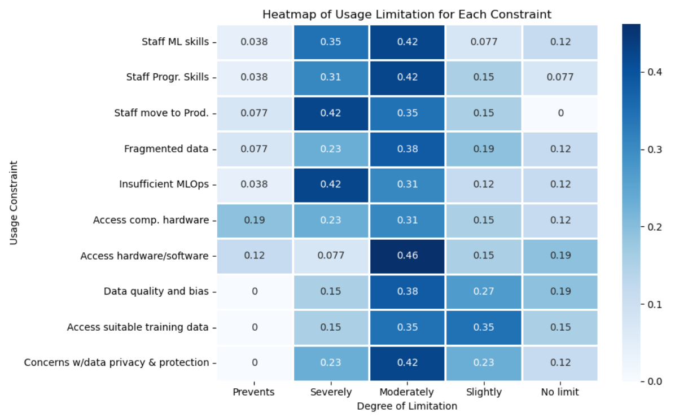 *d3_01* **Availability of staff with appropriate machine learning algorithm skills**is a problem. The lack of in-house machine learning expertise is one of the clearest obstacles. Most organisations report that limited staff ML skills moderately or severely restrict their ability to make effective use of ML. This indicates that, while awareness of ML is high, practical experience remains scarce. The consequence is often a dependence on external consultants or limited experimentation that never scales.

*d3_02* A similar pattern appears for **programming skills**. The transition from traditional analytics to ML demands greater coding fluency, and many organisations seem to be in the process of bridging that gap. This shortage may translate into longer development cycles, less reproducible workflows, and reliance on low-code tools that may hinder flexibility.

*d3_03* **Availability of staff to move the project into production and maintain it** is scarce. Even when models are developed, moving them into production is a major barrier. Severe and preventive limitations dominate here, showing that internationalizing ML, i.e. deploying models reliably, maintaining them, and integrating them with business systems, is still immature. This may reflect a lack of cross-functional collaboration between data science and IT teams.

*d3_04* **Data fragmentation** is another recurring issue. Many organisations face multiple data silos, inconsistent formats, or legacy systems that prevent seamless integration. The result is a patchy view of information, complicating both model training and evaluation. However, compared with skills gaps, the impact here appears somewhat less extreme, more a moderate limitation rather than a real barrier.

*d3_05* **Insufficient MLOps, model lifecycle management, practices and tools** is one of the most significant technical shortcomings. The combination of "severely limits" and "prevents use" responses shows that inadequate infrastructure for deployment, versioning, and monitoring hampers model reliability. Without mature MLOps, many projects stall at the prototype stage, never reaching stable operation.

*d3_06* Limited **access to suitable computational hardware**, such as GPUs or high-performance servers, affects some organisations but not all. The pattern suggests that while some have invested in adequate compute capacity or cloud solutions, others still struggle with outdated or shared resources, leading to slower training and testing cycles.

*d3_07* When asked more broadly about **access to hardware and software**, the responses are slightly more optimistic. Most organisations experience only moderate constraints, suggesting that basic IT infrastructure is generally available. Yet, even here, integration with ML-specific tools (e.g., experiment tracking or model registries) may be uneven.

*d3_08* Concerns about **Data quality and bias** remain prominent but do not appear catastrophic. Organisations acknowledge these as moderate challenges, which implies growing awareness and possibly some mitigation strategies, such as better data cleaning and validation pipelines.

*d3_09* **Access to relevant, well-labelled training data** continues to limit progress. Most respondents find it a moderate or slight constraint, meaning that while some data exist, its suitability or quantity may not always match project needs.

*d3_10* Finally, **data privacy and protection concerns** are a significant but nuanced limitation. They reflect not only technical barriers but also organisational caution and regulatory compliance. As rules like GDPR shape data governance, many teams proceed conservatively, prioritising protection over experimentation.

#### D3 Overall Results

Across these ten aspects, a clear hierarchy of limitations emerges. Human capital and organisational processes, particularly staff skills, MLOps maturity, and deployment readiness are the dominant constraints. Data issues and infrastructure challenges are real but secondary, often symptomatic of broader capacity gaps. The overall picture is of organisations that have the ambition and partial infrastructure for ML but lack the seamless combination of expertise, operational discipline, and governance needed for sustained success. Investing in training, developing internal MLOps pipelines, and strengthening data integration would likely yield the highest return in overcoming these technical limitations.

### Question D4

To what extent does your organization invest resources to tackle the following technical issues?:

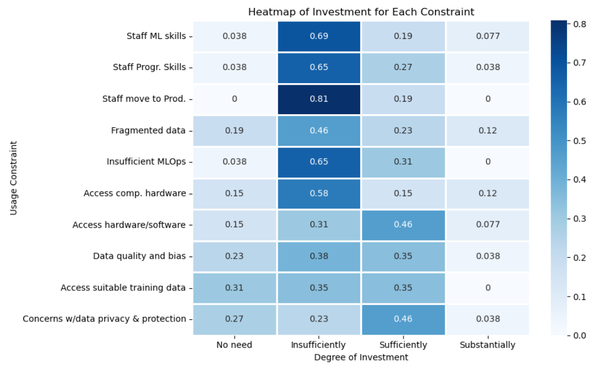 *d4_01* and *d4_02* In the areas of **machine learning** and **programming skills**, most organisations report that they are still underinvesting. Despite recognising that skill shortages are a major obstacle, the allocation of resources towards systematic staff development remains limited. This underlines a persistent gap between strategic awareness and operational follow-through, a theme that recurs throughout the results.

*d4_03* A similar situation is observed regarding the **deployment of models into production**. Many organisations still struggle to move from experimentation to implementation, reflecting the absence of mature MLOps practices and the need for greater investment in processes that bridge the gap between data science and operational environments.

*d4_04* The challenge of **fragmented data infrastructures** also persists. While some institutions have begun to invest in improving data integration, overall efforts remain inconsistent. Given that seamless data access and interoperability are critical enablers for AI adoption, the current level of investment suggests that this issue is being addressed, but not yet at the scale required.

*d4_05* In relation to **MLOps capacity building**, responses indicate that most organisations have yet to allocate sufficient resources. Since MLOps underpins reproducibility, automation, and scalability, this shortfall continues to hinder progress in operational AI maturity.

*d4_06* and *d4_07* For **computational hardware** and **software access**, investment levels are somewhat more balanced. Several organisations have ensured adequate infrastructure for standard workloads, though more advanced computing demands - such as large-scale model training - remain out of reach for many.

*d4_08* and *d4_09* When it comes to **data quality, bias mitigation**, and **access to suitable training data**, the picture is mixed. Some organisations have established effective data governance and quality frameworks, while others acknowledge ongoing difficulties in securing reliable and representative datasets. This unevenness likely reflects varying stages of institutional maturity and differing use cases.

*d4_10* Conversely, **data privacy and protection** appear to be relatively strong areas. Many organisations report that their current level of investment is sufficient, which likely reflects the influence of regulatory frameworks such as the GDPR and the institutionalisation of compliance-driven data management.

#### D4 Overall Results

Overall, these results suggest that most organisations have not yet aligned their investment priorities with the technical areas of greatest strategic importance. While training, MLOps, and data integration are widely recognized as key to overcoming existing barriers, actual resource allocation remains limited in these domains.

This misalignment highlights that many organisations are still consolidating foundational elements like infrastructure, governance, and compliance, before scaling towards more advanced AI operations. To achieve greater maturity, a deliberate shift towards targeted upskilling, operational AI pipelines, and integrated data ecosystems will be essential. Only by addressing these areas systematically can organisations fully capitalize on AI's potential in the age of trusted statistics.